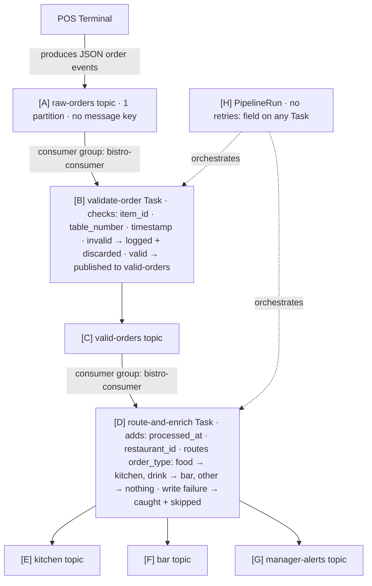

# Petit Agilé Bistro — Order Processing Pipeline

---

## Issue Types

| Type | Meaning |
|---|---|
| `dead-letter-missing` | Events that fail or can't be routed have nowhere to go — lost permanently |
| `idempotency-violation` | Reprocessing (restart, replay) causes duplicates downstream |
| `spof` | Single point of failure with no redundancy or isolation |
| `schema-evolution-risk` | Hardcoded assumptions break silently when a new event type or field arrives |
| `back-pressure-unchecked` | No mechanism to detect or limit lag when consumption falls behind production |
| `health-signal-absent` | No observable metric, log count, or heartbeat at this point in the pipeline |
| `retry-missing` | Transient failures cause permanent message loss — no retry policy |
